# Verilog-8-Band-Audio-Equalizer
Verilog project for a 8 Band Audio Equalizer implement on FPGAs

## 1. SPEC
```
Thiết kế bộ cân bằng âm thanh. 
Chi tiết về bộ Equalizer: Audio equalizer based on FIR filters. | controlpaths.com

Đầu vào: Âm thanh được lấy mẫu với tần số 16Khz, độ rộng bit là 16 bit.
Đầu vào: 8 hệ số khuếch đại cho 8 băng tần số cần cân bằng
Đầu ra: Tín hiệu âm thanh ra. 
Kết quả cần báo cáo:
Độ trễ từ đầu vào đến đầu ra. 
Số cell FPGA cần sử dụng. 
Cách mô phỏng chứng minh mạch hoạt động đúng
Dùng python đọc file wav, vẽ đồ thị phổ của file wav
Tạo file đầu vào là file text với mỗi hàng là 1 mẫu âm thanh lưu là 1 số HEX 16 bit
Testbench đọc file text âm thanh đầu vào vào mảng bộ nhớ 16bit và đưa vào mạch. 
Testbench lấy đầu ra của mạch và lưu vào file text output.txt mỗi hàng 1 là giá trị mẫu âm thanh 
Dùng python đọc file output.txt và chuyển thành file wav, vẽ đồ thị phổ
Dùng python tạo file outout_python.txt bằng cách dùng các hàm của python để tạo ra bộ Equalizer. So sánh kết quả output.txt với file output_python.txt
Tổng hợp mạch bằng FPGA báo cáo các resource cần sử dụng: số cell logic, số LUT, số DSP, số RAM
```
## 2. Làm việc với file WAV
### 2.1. Xác định các tham số, thông số file
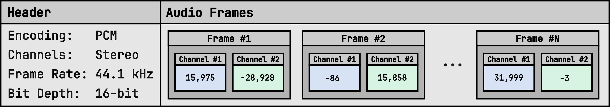

Với yêu cầu sử dụng định dạng <b>wav</b> để làm việc cùng, chúng ta cũng cần xác định được các thông số đặc trưng:
- <b>encoding</b>: Cách mã hoá
  <b>=> PCM</b>
- <b>channels</b>: Số kênh âm thanh (1 cho mono, 2 cho stereo)
  <b>=> mono (Đơn âm sắc)</b>
- <b>sample_width/bit_depth</b>: Số byte cho mỗi mẫu âm thanh
  <b>=> 2 bytes (16 bit)</b>
- <b>frame_rate</b>: Tần số mẫu (số mẫu âm thanh trên giây)
  <b>=> 16 KHz (16000 mẫu/giây)</b>
- <b>num_frames</b>: Số frame âm thanh
  <b>=> Tuỳ file</b>
- <b>duration = num_frames / frame_rate</b>: Thời lượng (giây)
  <b>=> Tuỳ file</b>
- <b>is_signed</b>: Giá trị có dấu hay không có dấu
  <b>=> Có dấu</b>
- <b>is_integer</b>: Giá trị nguyên hay thực
  <b>=> Nguyên</b>
- <b>is_fixedpoint</b>: Giá trị dấu phẩy tĩnh hay dấu phẩy động (nếu là số thực)
  <b>=> Không tĩnh không động</b>
- ...
### 2.2. Tương tác file WAV
#### 2.2.1. Chuyển đổi định dạng
Trong quá trình thực hiện, chúng ta có thể cần chuyển đổi các định dạng âm thanh khác về WAV với các cài đặt về thông số như đã mô tả ở mục trước. Việc này có thể đạt được thông qua sử dụng các nền tảng chuyển đổi định dạng tệp tin trực tuyến. Ở đây tôi sử dụng trang web <a href="https://g711.org">g711.org</a>, chọn tham số phù hợp cho file đầu ra như sau:

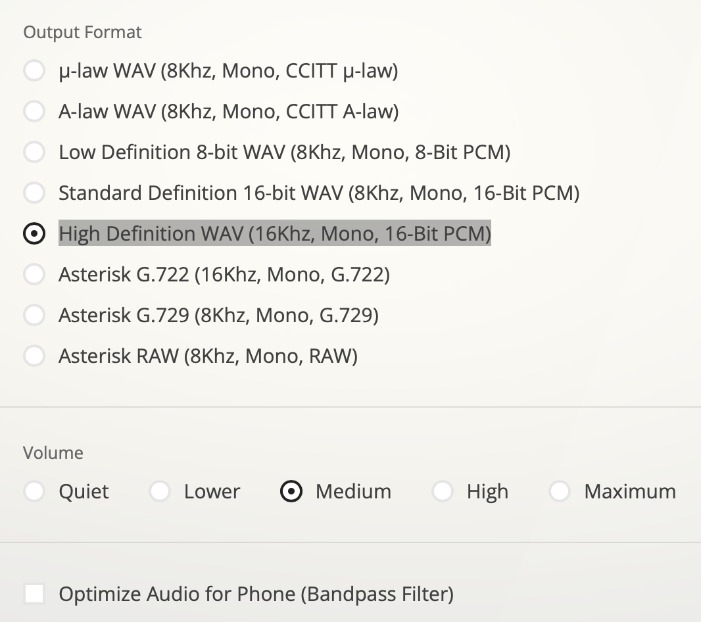

#### 2.2.2. Lớp Wav để xử lý các tác vụ
Sử dụng ngôn ngữ lập trình Python cùng với thư viện <a href="https://scipy.org">scipy</a> và <a href="https://docs.python.org/3/library/wave.html">wave</a>, tôi tạo một lớp Wav để có thể xử lý các tác vụ cần thiết lên trên file:
- open: mở file wave với đường dẫn và đọc, lưu dữ liệu vào các thuộc tính tương ứng trong đối tượng của lớp Wav.
- save_as: lưu đối tượng này thành một file WAV vào đường dẫn.
- save_as_txt: lưu đối tượng này thành một file .txt vào đường dẫn. Mỗi dòng sẽ tương ứng với một mẫu giá trị biên độ của âm thanh, thể hiện dưới dạng bit. VD:
    ```
    . . .
    1111110100100011
    1111110110011101
    1111110001110010
    . . .
    ```
- resample: thay đổi sample_rate (tốc độ lấy mẫu) của đối tượng. VD: 16000 --> 20000 (Hz).
- và một số hàm hỗ trợ khác được cung cấp trong lớp Wav này...
## 3. Bộ lọc
Để có một bộ lọc tốt cần cân bằng giữa các yếu tố và thường là có sự đánh đổi lẫn nhau như chất lượng bộ lọc cao sẽ có độ trễ và độ phức tạp tính toán cao, khó triển khai phần cứng,...

Các tham số bộ lọc sẽ phụ thuộc vào tính chất của tín hiệu. VD: tín hiệu có băng tần rộng thì khi chia 8 dải tầng sẽ thoải mái hơn cho việc rò rỉ, ISI giữa các vùng đáp ứng xung của các bộ lọc với nhau. Tín hiệu có độ tập trung năng lượng cao vào vùng tần số nào thì chất lượng của bộ lọc tại vùng tần số đó cần được đảm bảo hơn...

Để cho đơn giản, chúng ta sẽ cố gắng thiết kế các bộ lọc với số lượng mẫu phản ứng xung giống nhau và số mẫu này là tối thiểu sao cho vẫn giữ được đặc tính cũ của tín hiệu gốc (ở mức độ tương đối, không tệ quá là được hehee). Việc này sẽ giúp việc thiết kế trên phần cứng sử dụng ngôn ngữ mô tả phần cứng dễ dàng hơn, dễ dàng tính toán, tuỳ chỉnh tổ hợp các mẫu phản ứng xung trên từng bộ lọc.
### 3.1. FIR và IIR
#### 3.1.1. FIR
##### 3.1.1.1. Đặc điểm
Bộ lọc FIR có đáp ứng xung hữu hạn, có nghĩa là đáp ứng đầu ra sẽ dần dần giảm xuống không sau một số lượng mẫu hữu hạn.
Đầu ra phụ thuộc vào hệ số của bộ lọc tích chập lên đầu vào hiện tại cũng như các mẫu trước đó.

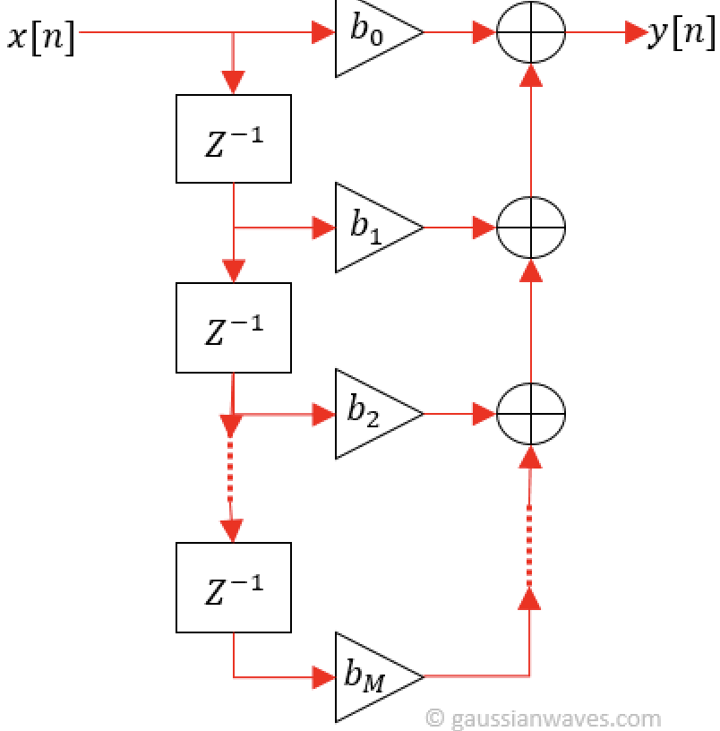

Thường thì cấu trúc của FIR sẽ là một bộ Feedforward như hình trên. Có thể thấy FIR filter thường được thiết kế để có phản hồi xung không có phản hồi ngược, điều này có nghĩa là không có các hệ số trong hàm truyền tải phản hồi về các thành phần tính toán trước đó.
Vì không có phản hồi ngược, FIR filter thường dễ thiết kế và ổn định hơn trong các ứng dụng yêu cầu chính xác cao.
##### 3.1.1.2. Ưu và nhược:
###### a) Ưu điểm:
- <b>Đáp ứng pha tuyến tính</b>, có nghĩa là tất cả các tần số trải qua cùng một lượng trễ qua bộ lọc. Điều này quan trọng trong các ứng dụng yêu cầu bảo toàn mối quan hệ pha của tín hiệu đầu vào, đặc biệt trong <b style="color:red;">xử lý âm thanh và hình ảnh</b>.
- <b>Ổn định</b>. Đáp ứng pha, phổ của hệ thống là an toàn, không gặp phải một số vấn đề khiến cho đầu ra của tín hiệu bị thay đổi hoàn toàn như một số trường hợp mà bộ lọc IIR có thể gặp phải.
- <b>Dễ thiết kế, chỉnh sửa, triển khai</b>. Việc thay đổi các tham số của bộ lọc chỉ là việc thay các mẫu phản ứng xung trong các thanh ghi tính toán.

###### b) Nhược điểm:
- <b>Độ phức tạp tính toán cao</b>, đòi hỏi nhiều tài nguyên tính toán hơn so với bộ lọc IIR, đặc biệt là đối với bộ lọc cấp cao hoặc bộ lọc có số lượng tapsn (mẫu phản ứng xung h[n]) lớn.
- <b>Đáp ứng đột ngột</b> dài hơn so với bộ lọc IIR, đặc biệt là đối với các chuyển đổi sắc nét trong miền tần số. Tức là khi tín hiệu thay đổi biên độ rất nhanh thì bộ lọc FIR sẽ cần thêm thời gian để thích ứng. Nhưng điều này không phải là một vấn đề quá lớn khi chúng ta đang focus vào ứng dụng trong audio singal, thứ mà thường sẽ có dải sóng thay đổi không quá đột ngột.
#### 3.1.2. IIR
##### 3.1.2.1. Đặc điểm
Bộ lọc IIR có đáp ứng xung vô hạn, có nghĩa là đầu ra có thể phụ thuộc vào một lịch sử vô hạn các mẫu đầu vào.
Đầu ra là đệ quy của cả đầu vào hiện tại và các mẫu đầu ra trước đó kết hợp cùng phản hồi của đầu ra.

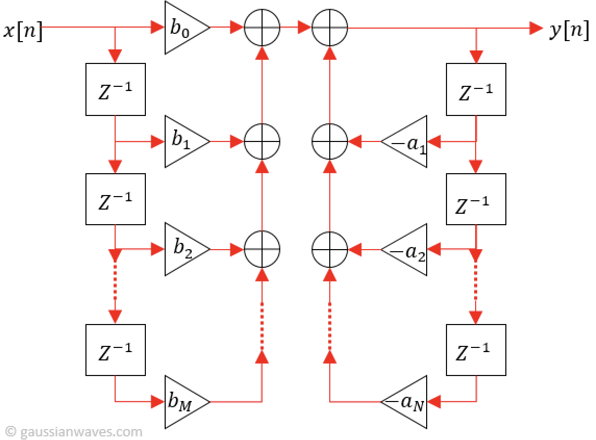

Thường thì cấu trúc của IIR sẽ là một bộ Feedforward kết hợp Feedbackward như hình trên.
##### 3.1.2.2. Ưu và nhược:
###### a) Ưu điểm:
- Đòi hỏi ít tài nguyên tính toán hơn so với bộ lọc FIR để đạt được các đặc tính bộ lọc tương tự.
- Hiệu quả hơn cho việc lọc dải hẹp: Bộ lọc IIR thường hiệu quả hơn cho các ứng dụng lọc dải hẹp.
###### b) Nhược điểm:
- <b>Biến dạng pha phi tuyến</b> có thể ảnh hưởng tới các ứng dụng yêu cầu bảo toàn mối quan hệ pha, như xử lý âm thanh, hình ảnh!
- <b>Xuất hiện dao động không ổn định</b> trong một số điều kiện.
- <b>Hạn chế thiết kế</b> với các đáp ứng tần số cụ thể, đặc biệt là để đạt được các đặc tính pha tuyến tính.
#### 3.1.3. Lựa chọn loại bộ lọc
IIR filter thường có thể đạt được hiệu suất cao hơn với số lượng bộ lọc nhỏ hơn so với FIR filter, nhưng cũng không ổn định nếu không được thiết kế cẩn thận. Ngoài ra đáp ứng pha không tuyến tính có thể khiến cho các đặc điểm gốc trong tín hiệu bị biến dạng, điều này không phù hợp cho yêu cầu của chúng ta đó chính là xử lý tín hiệu âm thanh.
FIR filter thường được sử dụng cho các ứng dụng yêu cầu độ chính xác cao, ổn định tốt như lọc tần số cụ thể hoặc làm sạch tín hiệu, xử lý audio, image. Vậy thì chúng ta đành phải đánh đổi về mặt tài nguyên phần cứng, tốc độ xử lý, độ trễ tính toán,... để có thể thực hiện loại bộ lọc FIR lên FPGAs.
<b>=> CHỐT: SỬ DỤNG BỘ LỌC FIR TRONG THIẾT KẾ</b>.

### 3.2. Thiết kế bộ lọc FIR
#### 3.2.1. Lựa chọn phương pháp thiết kế
##### 3.2.1.1. Các phương pháp:
###### a) Phương pháp cửa sổ (Window method):
Phương pháp này bao gồm việc lấy Fourier của một phản ứng yêu cầu với hàm cửa sổ như cửa sổ Hamming, cửa sổ Blackman, cửa sổ Kaiser,... và sau đó chuyển đổi Fourier ngược trở lại để lấy được hệ số của bộ lọc FIR.

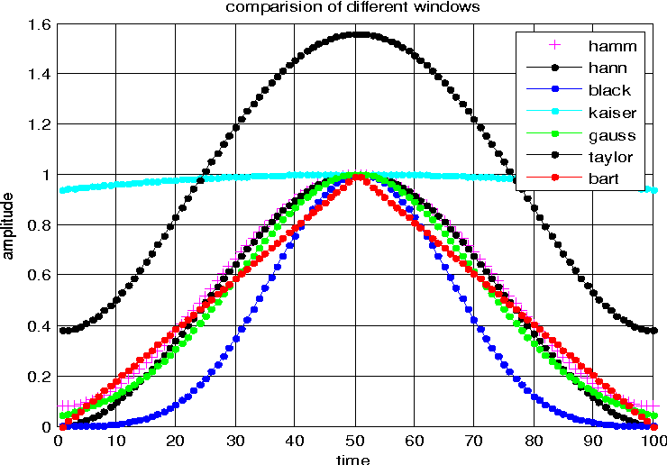

##### b) Các phương pháp khác:
- __Phương pháp đồng bộ (Equiripple method)__: Đây là một phương pháp thiết kế bộ lọc FIR đặc biệt dùng cho các ứng dụng yêu cầu sự đồng đều về biên độ trên dải tần số cụ thể. Ví dụ, phương pháp Parks-McClellan là một phương pháp phổ biến trong phương pháp này.
- __Phương pháp tối thiểu bình phương (Least squares method)__: Phương pháp này tìm kiếm hệ số của bộ lọc FIR sao cho độ lỗi bình phương giữa phản ứng yêu cầu và phản ứng của bộ lọc là nhỏ nhất.
- __Phương pháp đệ quy (Recursive method)__: Đối với các bộ lọc FIR có độ dài lớn, việc tính toán hệ số có thể trở nên tốn kém. Trong trường hợp này, có thể sử dụng phương pháp đệ quy để tính toán hệ số bộ lọc một cách hiệu quả hơn.
- __Phương pháp tối ưu hóa (Optimization method)__: Sử dụng các thuật toán tối ưu hóa như thuật toán di truyền, thuật toán tối ưu hóa hạt giống, hoặc các phương pháp tối ưu hóa liên tục để tìm ra bộ lọc FIR tối ưu dựa trên các tiêu chí như độ trễ, độ rộng dải tần số chuyển đổi, hoặc tiêu chuẩn cụ thể khác.
##### 3.2.1.2. Chốt lựa chọn
__Phương pháp cửa sổ__ được chọn để sử dụng trong việc thiết kế bộ lọc FIR vì:
- __Dễ hiểu và triển khai__: Phương pháp cửa sổ dựa trên việc lấy Fourier của phản ứng yêu cầu với một hàm cửa sổ nhất định và sau đó chuyển đổi Fourier ngược trở lại để lấy được hệ số của bộ lọc FIR. Quy trình này tương đối đơn giản và dễ triển khai.
- __Đáp ứng tần số tốt__: Các hàm cửa sổ như cửa sổ Hamming, cửa sổ Blackman, và cửa sổ Kaiser thường được sử dụng trong phương pháp cửa sổ. Những cửa sổ này có đáp ứng tần số tốt, giảm thiểu hiện tượng rò rỉ tần số (frequency leakage) và nén tín hiệu (signal smearing) trong quá trình chuyển đổi Fourier.
- __Kiểm soát độ rộng dải tần số chuyển đổi__: Với việc lựa chọn hàm cửa sổ phù hợp, có thể kiểm soát độ rộng của dải tần số chuyển đổi của bộ lọc FIR. Điều này quan trọng trong việc đảm bảo rằng bộ lọc chỉ áp dụng các biến đổi tần số vào dải tần số cần thiết mà không ảnh hưởng đến các thành phần tần số khác của tín hiệu.
#### 3.2.2. Lựa chọn loại cửa sổ
<a href="https://colab.research.google.com/drive/1oOBK2cRURK4gT0YH0xGaAE_VIMrqRGYk?authuser=1#scrollTo=J5cV4cfxlhZb&uniqifier=3">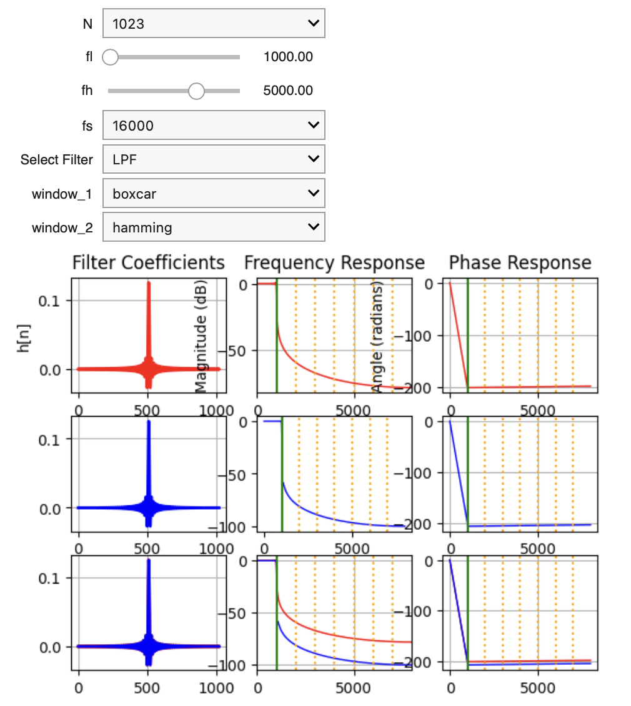</a>
Phần report + code cho hiển thị tương tác trực quan với phổ có thể được tìm thấy ở đây: <a href="https://colab.research.google.com/drive/1oOBK2cRURK4gT0YH0xGaAE_VIMrqRGYk?authuser=1#scrollTo=J5cV4cfxlhZb&uniqifier=3">Code siêu đỉnh của Đào Quyết</a>
##### 3.2.2.1. So sánh đáp ứng tần số và đáp ứng pha
###### a) Cửa sổ chữ nhật (Boxcar/rectangle) vs cửa sổ Hamming
*Màu đỏ: Cửa sổ chữ nhật
*Màu xanh: Cửa sổ Hamming

<table>
  <thead>
    <th>N</th>
    <th>Thông thấp</th>
    <th>Thông cao</th>
    <th>Thông dải</th>
  </thead>
  <tbody>
    <tr>
      <td>7</td>
      <td>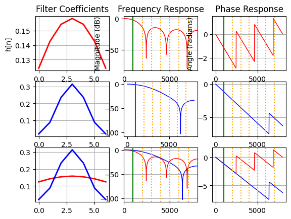</td>
      <td></td>
      <td>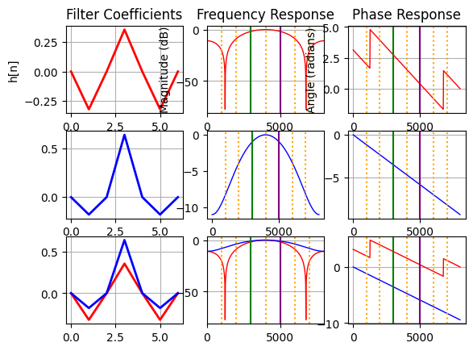</td>
    </tr>
    <tr>
      <td>63</td>
      <td>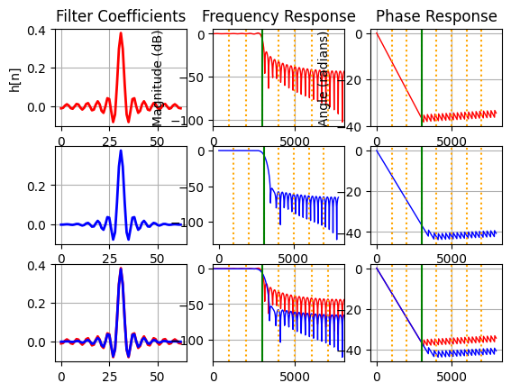</td>
      <td></td>
      <td>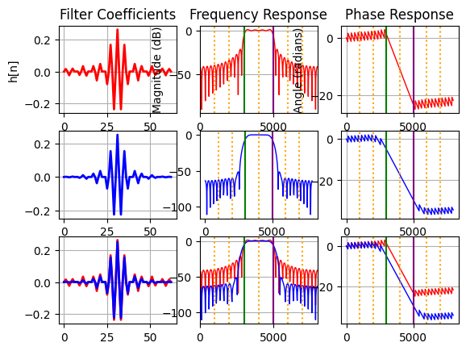</td>
    </tr>
    <tr>
      <td>1023</td>
      <td>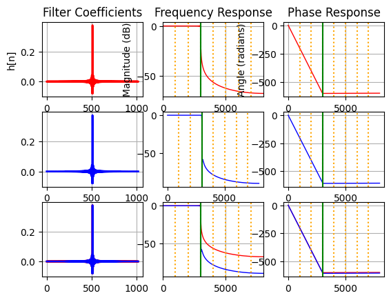</td>
      <td></td>
      <td>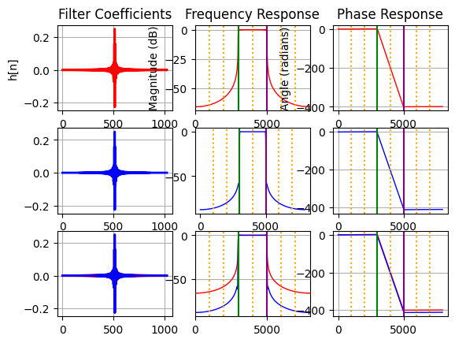</td>
    </tr>
  </tbody>
</table>

###### b) So sánh các loại cửa sổ khác
Nếu muốn so sánh các loại cửa sổ khác nhau, hãy dùng giao diện được cung cấp trong <a href="https://colab.research.google.com/drive/1oOBK2cRURK4gT0YH0xGaAE_VIMrqRGYk?authuser=1#scrollTo=J5cV4cfxlhZb&uniqifier=3">Code siêu đỉnh của Đào Quyết</a> để tự khám phá và đánh giá nhé!

### 3.2. Phân tích phổ tín hiệu, phổ tần số
#### 3.2.1. File gốc

https://github.com/Qyt0109/Verilog-8-Band-Audio-Equalizer/assets/92682344/a0692e70-c902-4dc9-9eb7-f4c0a3fb804e

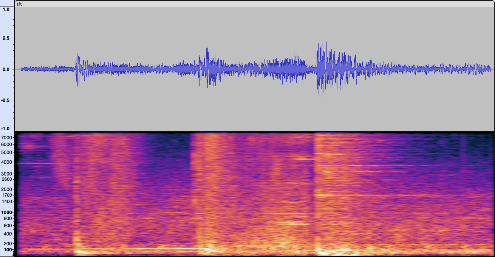

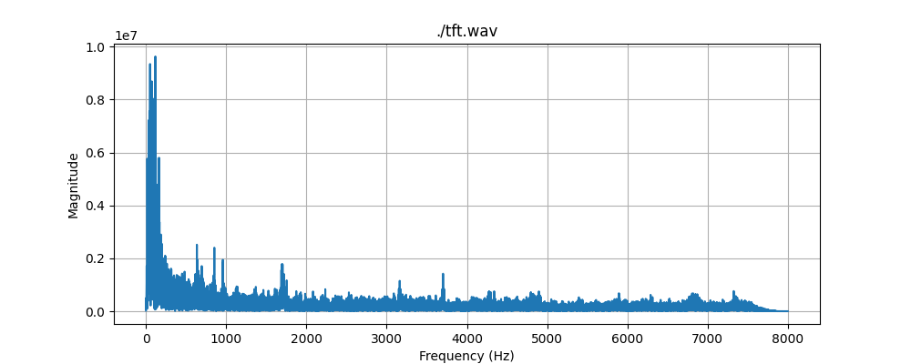

#### 3.2.2. Sử dụng các bộ lọc
##### 3.2.2.1. Các bộ lọc chất lượng cao, thực hiện trên phần mềm viết bằng Python
Với chất lượng bộ lọc tốt, số lượng mẫu phản ứng xung (impulse response taps) N = 1023, cửa sổ Hamming.
###### a) LPF

https://github.com/Qyt0109/Verilog-8-Band-Audio-Equalizer/assets/92682344/15adc480-3bbe-4c50-8180-b1b65febd71f

Lọc thông thấp (Low Pass Filter) với tần số cắt fc = 1000 (Hz)
Đáp ứng xung (Frequency Response):
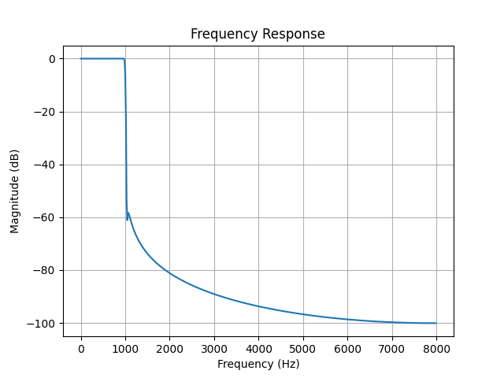

Tín hiệu sau lọc có phổ giới hạn tối đa tương ứng với tần số cắt, gần như không có sự rò rỉ tần số:
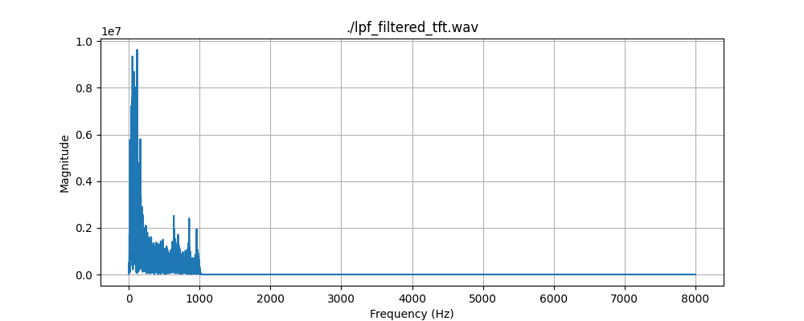

###### b) HPF

https://github.com/Qyt0109/Verilog-8-Band-Audio-Equalizer/assets/92682344/3fd25c70-9f6b-42dc-8d69-16a0c6e711cf

Lọc thông cao (High Pass Filter) với tần số cắt fc = 7000 (Hz)
Đáp ứng xung (Frequency Response):
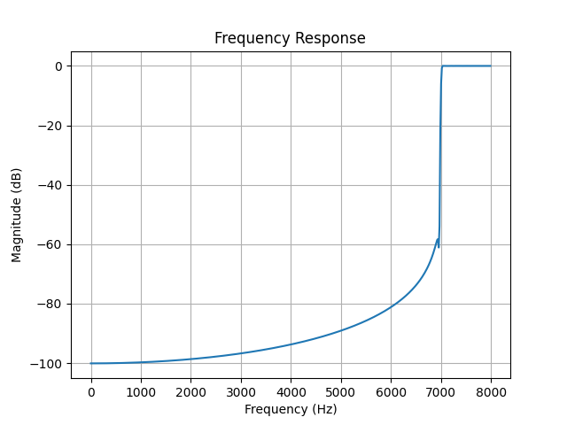

Tín hiệu sau lọc có phổ giới hạn tối thiểu tương ứng với tần số cắt, gần như không có sự rò rỉ tần số:
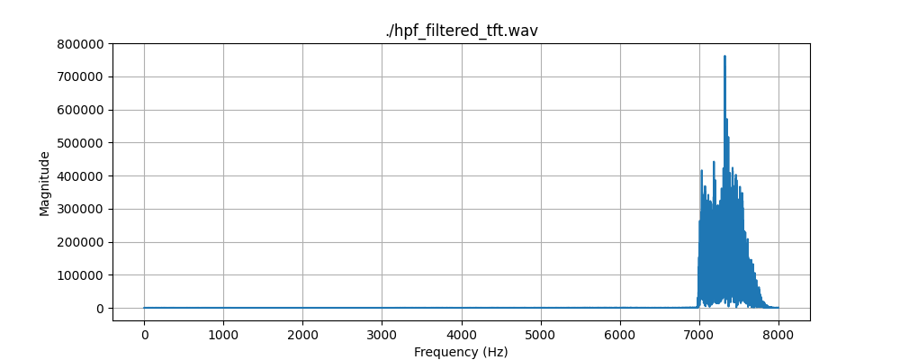

###### b) BPF

https://github.com/Qyt0109/Verilog-8-Band-Audio-Equalizer/assets/92682344/b3fd8ca6-ea07-4787-adc6-8db8b5d47939

Lọc thông dải (Band Pass Filter) với tần số cắt fc = (fc_l, fc_h)  = (3000, 5000) (Hz)
Đáp ứng xung (Frequency Response):
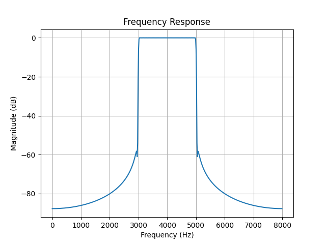

Tín hiệu sau lọc có phổ giới hạn tương ứng với tần số cắt, gần như không có sự rò rỉ tần số:
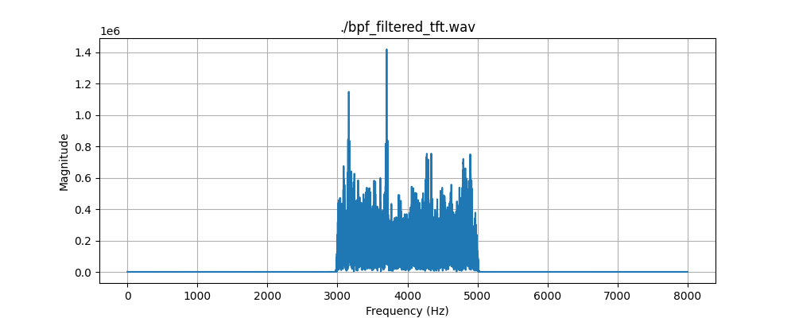
