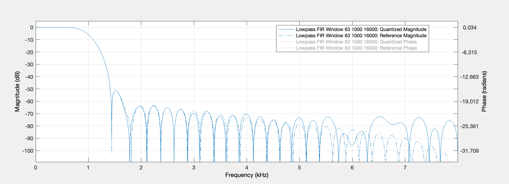
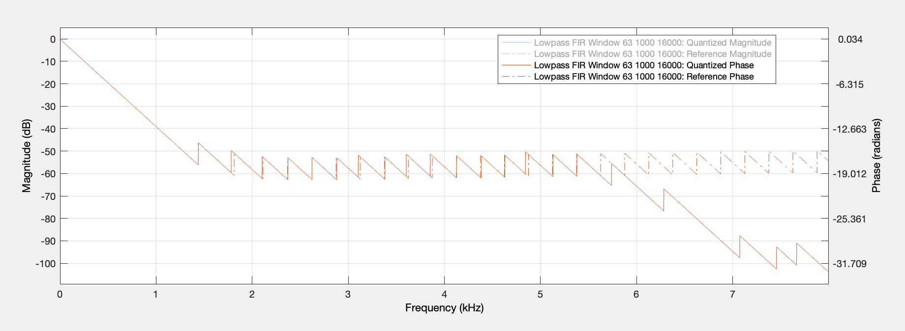

<table>
    <th>
      <a href="./chap2.md"><< CHƯƠNG TRƯỚC</a>
    </th>
    <th>
      3/3
    </th>
    <th>
      CHƯƠNG SAU >>
    </th>
</table>

## 4. Thiết kế phần cứng

### 4.1. Các module tính toán

#### 4.1.1. Biểu diễn số trong thiết kế

##### 4.1.1.1. Các mẫu âm thanh của file WAV

File WAV 16 bit PCM: mỗi mẫu là một 1 chuỗi 16 bit biểu diễn giá trị số nguyên có dấu, thể hiện biên độ của âm thanh tại thời điểm lấy mẫu.

##### 4.1.1.2. Các mẫu hệ số (coefficients) h[n] của bộ lọc

###### a) Đặc điểm
Tập giá trị của h[n] với N mẫu sẽ là các số thực có dấu nằm trong khoảng [-1, 1), thường số này là rất nhỏ (VD với N = 63 có một mẫu là -0.0004...).

N càng lớn thì sự chênh lệch giữa phần chữ số có nghĩa trong giá trị không dấu của phần phân số trong hệ số sẽ càng lớn (max |h[n]| và min |h[n]|), và khoảng giá trị cần biểu diễn sẽ càng hẹp (từ min h[n] tới max h[n]):

<table>
  <thead>
    <th>
      N
    </th>
    <th>
      Đồ thị minh hoạ
    </th>
    <th>
      Giá trị
    </th>
  </thead>
  <tbody>
    <tr>
      <td>
        3
      </td>
      <td>
        
      </td>
      <td>
        
max h[n]: 0.8885144265986638

        
min h[n]: 0.05574278670066811

        
max |h[n]|: 0.8885144265986638

        
min |h[n]|: 0.05574278670066811

      </td>
    </tr>
    <tr>
      <td>
        63
      </td>
      <td>
        
      </td>
      <td>
        
max h[n]: 0.37543968977261155

        
min h[n]: -0.07670069733372484

        
max |h[n]|: 0.37543968977261155

        
min |h[n]|: 2.7949187229014548e-18

      </td>
    </tr>
  </tbody>
</table>

###### b) Lượng tử hoá
Để có thể biểu diễn tập h[n] sẽ cần một kiểu dữ liệu có dấu (signed), biểu diễn được giá trị số thực (double hoặc fixed-point,...) và có độ chính xác tốt để khi thực hiện lượng tử hoá không làm thay đổi quá nhiều so với ban đầu, bao gồm về khoảng giá trị [min h[n], max h[n]] cũng như độ chính xác của min, max |h[n]|.

Lựa chọn kiểu biểu diễn __signed fixed-point (Q format)__ n bit với k bit là phần phân số (k có thể lớn hơn n !!!).

Ví dụ về Q format 8 bit, 1 bit dấu, 3 bit phần nguyên và 4 bit phần phân số:

###### c)
Để biểu diễn cho 1 mẫu hệ số bằng chuỗi k bit thì sẽ cần 1 bit cho bit dấu và k-1 bit cho phần phân số (fraction). Càng nhiều bit được sử dụng, h[n] được biểu diễn càng chính xác và từ đó bộ lọc cũng sẽ có chất lượng sát hơn với bộ lọc chuẩn.

Với N=63, sử dụng 16 bit (1 bit dấu, 15 bit phân số) để có thể lưu trữ tương đối tập h[n] trong thiết kế. Sau khi các mẫu được lượng tử hoá, khi so sánh đáp ứng tần số, đáp ứng pha cho thấy chất lượng của bộ lọc có bị giảm đi:

Đáp ứng tần số bị tăng lên ở dải chặn, mấp mô dải chặn (stop band ripple) tăng lên là dễ nhận thấy nhất. Được cái là vùng quan trọng nhất, phần dải thông của chúng ta không bị ảnh hưởng mấy.

Đáp ứng pha trong vùng quan trọng vẫn giữ được sự tuyến tính nhưng kéo dần tới dải chặn có thể thấy đáp ứng pha bị drop xuống thay vì giữ quy luật cũ.

Tuy nhiên để giảm tài nguyên phần cứng, giảm độ phức tạp tính toán,... cho thiết kế của bộ lọc thì mình sẵn sàng đánh đổi một chút (không quá đáng kể) về chất lượng của bộ lọc.

##### 4.1.1.3. Phép nhân số nguyên với số thực

Các mẫu âm thanh (đầu vào) của hệ thống là 16 bit số nguyên có dấu, trong khi đó các hệ số bộ lọc lại là 16 bit số thực có dấu, chủ yếu biểu diễn giá trị thập phân. Việc tính toán phép nhân cho 2 loại dữ liệu trên có thể được phân ra thành một số cách:
- TODO: cách nhân

<table>
    <th>
      <a href="./chap2.md"><< CHƯƠNG TRƯỚC</a>
    </th>
    <th>
      3/3
    </th>
    <th>
      CHƯƠNG SAU >>
    </th>
</table>