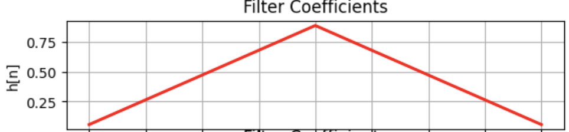
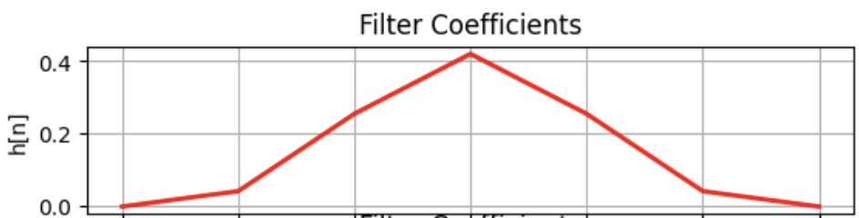
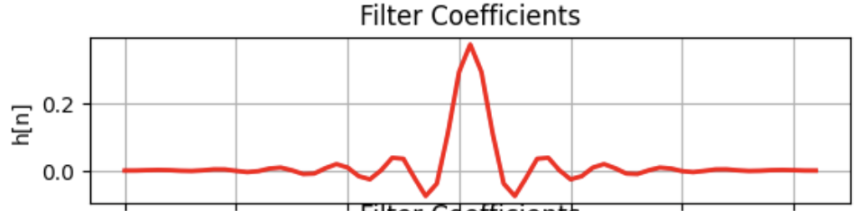
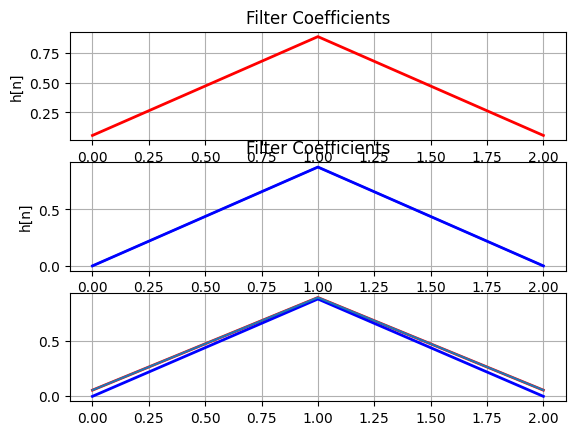
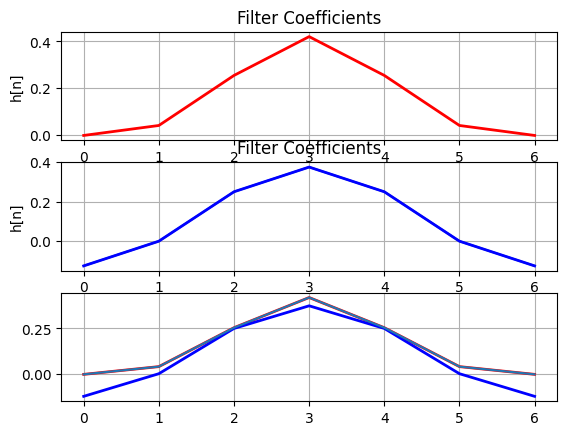
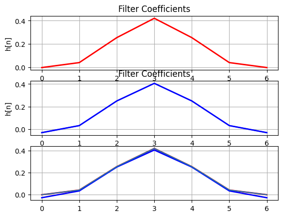
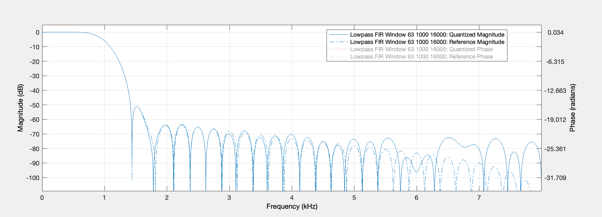
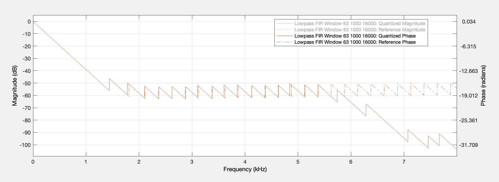
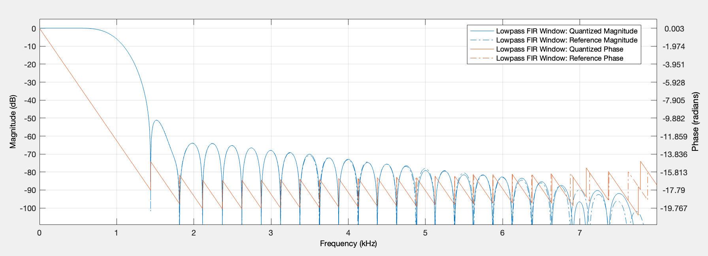

<table>
    <th>
      <a href="./chap2.md"><< CHƯƠNG TRƯỚC</a>
    </th>
    <th>
      3/3
    </th>
    <th>
      CHƯƠNG SAU >>
    </th>
</table>

## 4. Thiết kế phần cứng

### 4.1. Biểu diễn số trong thiết kế

#### 4.1.1. Các mẫu âm thanh của file WAV

File __WAV 16 bit PCM__: mỗi mẫu là một 1 chuỗi __16 bit__ biểu diễn giá trị __số nguyên có dấu__, thể hiện __biên độ của âm thanh__ tại __thời điểm lấy mẫu__.

Đặc điểm:
- __Format__: Số nguyên có dấu kiểu bù 2. 1 msb cho bit dấu, 15 bit biểu diễn giá trị.
- __Khoảng giá trị__: [-32768, 32767]
- __Bước giá trị__: 1

#### 4.1.2. Các mẫu hệ số (coefficients) h[n] của bộ lọc

##### 4.1.2.1. Đặc điểm
Tập giá trị của __h[n] với N mẫu__ sẽ là các số thực có dấu, thường số này là rất nhỏ (VD với N = 63 có một mẫu là -0.0004...).

__N càng lớn__ thì sự chênh lệch giữa phần chữ số có nghĩa trong giá trị không dấu của phần phân số trong hệ số sẽ càng lớn (__max |h[n]| và min |h[n]|__), và khoảng giá trị cần biểu diễn sẽ càng hẹp (__từ min h[n] tới max h[n]__):

<table>
  <thead>
    <th>N</th>
    <th>Đồ thị minh hoạ</th>
    <th>Giá trị</th>
  </thead>
  <tbody>
    <tr>
      <td>
        3
      </td>
      <td>
        
      </td>
      <td>
        
max h[n]: 0.8885144265986638

        
min h[n]: 0.05574278670066811

        
max |h[n]|: 0.8885144265986638

        
min |h[n]|: 0.05574278670066811

      </td>
    </tr>
    <tr>
      <td>
        7
      </td>
      <td>
        
      </td>
      <td>
        
max h[n]: 0.42079935508947686

        
min h[n]: -0.0036450401631491036

        
max |h[n]|: 0.42079935508947686

        
min |h[n]|: 0.0036450401631491036

      </td>
    </tr>
    <tr>
      <td>
        63
      </td>
      <td>
        
      </td>
      <td>
        
max h[n]: 0.37543968977261155

        
min h[n]: -0.07670069733372484

        
max |h[n]|: 0.37543968977261155

        
min |h[n]|: 2.7949187229014548e-18

      </td>
    </tr>
  </tbody>
</table>

##### 4.1.2.2. Lượng tử hoá
Để có thể biểu diễn tập h[n] sẽ cần một kiểu dữ liệu __có dấu (signed)__, biểu diễn được giá trị __số thực__ (double hoặc fixed-point,...) và có độ chính xác tốt để khi thực hiện lượng tử hoá không làm thay đổi quá nhiều so với ban đầu, bao gồm về khoảng giá trị [min h[n], max h[n]] cũng như độ chính xác của min, max |h[n]|.

Lựa chọn kiểu biểu diễn __signed fixed-point (Q format)__ k bit với f bit là phần phân số (f có thể lớn hơn k !!!).

Ví dụ về Q format 8 bit, 1 bit dấu, 3 bit phần nguyên và 4 bit phần phân số:

Đặc điểm trong ví dụ trên:
- __Format__: Số thực có dấu kiểu bù 2. 1 msb cho bit dấu, 7 bit biểu diễn giá trị trong đó 3 bit cho phần nguyên và 4 bit cho phần phân số.
- __Khoảng giá trị__: [-8.0, 7.9375]
- __Bước giá trị__: 0.0625

##### 4.1.2.3. Lựa chọn tham số lượng tử cho h[n] của bộ lọc
Để biểu diễn cho 1 mẫu hệ số bằng chuỗi k bit thì sẽ cần 1 bit cho bit dấu và x bit cho phần phân số (fraction). Càng nhiều bit được sử dụng, h[n] được biểu diễn càng chính xác và từ đó bộ lọc cũng sẽ có chất lượng sát hơn với bộ lọc chuẩn.

* __Số bit__: k
* __Số bit cho phần phân số__: x
* __Màu đỏ__: h[n] gốc
* __Màu xanh__: h[n] sau lượng tử

<table>
  <thead>
    <th>N</th>
    <th>Lượng tử hoá</th>
  </thead>
  <tbody>
    <tr>
      <td>3</td>
      <td>
        
        k = 4, x = 3 => OK
      </td>
    </tr>
    <tr>
      <td>7</td>
      <td>
        
        k = 4, x = 3 => NO
        
        k = 5, x = 5 => OK
      </td>
    </tr>
  </tbody>
</table>

Phân tích:
- N càng lớn, khoảng càng hẹp => giá trị tuyệt đối tối đa giảm => số bit cho phần số thực giảm đi.
- N càng lớn, độ chính xác càng cần phải cao => bước giá trị nhỏ hơn => số bit cho phần phân số tăng lên.

##### 4.1.2.4. Áp dụng cho bộ lọc N = 63
###### a) Phân tích:
Với N=63, đặc điểm của tập h[n]:
- __max h[n]__: 0.37543968977261155
- __min h[n]__: -0.07670069733372484
- __max |h[n]|__: 0.37543968977261155
- __min |h[n]|__: 2.7949187229014548e-18

Yêu cầu dạng biểu diễn:
- __Khoảng giá trị tuyệt đối__ từ 0 tới max |h[n]| hay [0, 0.37543968977261155].
- __Độ chính xác__ để bảo toàn được các chữ số có ý nghĩa của min |h[n]| = 2.7949187229014548e-18.

###### b) Lựa chọn dạng biểu diễn
Sử dụng 16 bit (1 bit dấu, 15 bit phân số) để có thể lưu trữ tương đối tập h[n] trong thiết kế, đặc điểm của dạng biểu diễn:
- __Khoảng giá trị__: [-1, 0.999969482421875] => OK
- __Bước giá trị__: 3.0517578125e-05

Sau khi các mẫu được lượng tử hoá, khi so sánh đáp ứng tần số, đáp ứng pha cho thấy chất lượng của bộ lọc có bị giảm đi:

Đáp ứng tần số bị tăng lên ở dải chặn, mấp mô dải chặn (stop band ripple) tăng lên là dễ nhận thấy nhất. Được cái là vùng quan trọng nhất, phần dải thông của chúng ta không bị ảnh hưởng mấy.

Đáp ứng pha trong vùng quan trọng vẫn giữ được sự tuyến tính nhưng kéo dần tới dải chặn có thể thấy đáp ứng pha bị drop xuống thay vì giữ quy luật cũ.

Với đặc điểm này thì vẫn có thể chấp nhận được.

Sử dụng k = 16 bit biểu diễn, 1 bit dấu, 15 bit còn lại để biểu diễn x = 16 bit phân số (!!! Nghe khá lạ nhưng tìm hiểu thêm về Q format nhé) để có thể lưu trữ tương đối tập h[n] trong thiết kế, đặc điểm của dạng biểu diễn:
- __Khoảng giá trị__: [-0.5, 0.4999847412109375] => OK
- __Bước giá trị__: 1.52587890625e-05 => Chính xác hơn

Sau khi các mẫu được lượng tử hoá, khi so sánh đáp ứng tần số, đáp ứng pha cho thấy chất lượng của bộ lọc rất tốt, gần như gốc.

Để giảm tài nguyên phần cứng, giảm độ phức tạp tính toán,... cho thiết kế của bộ lọc thì mình sẵn sàng đánh đổi một chút (không quá đáng kể) về chất lượng của bộ lọc.

=> __CHỐT: signed fixed-point 16 bit 16 bit fraction__

##### 4.1.1.3. Phép nhân số nguyên với số thực

Các mẫu âm thanh (đầu vào) của hệ thống là 16 bit số nguyên có dấu, trong khi đó các hệ số bộ lọc lại là 16 bit số thực có dấu, chủ yếu biểu diễn giá trị thập phân. Việc tính toán phép nhân cho 2 loại dữ liệu trên có thể được phân ra thành một số cách:
- TODO: cách nhân

<table>
    <th>
      <a href="./chap2.md"><< CHƯƠNG TRƯỚC</a>
    </th>
    <th>
      3/3
    </th>
    <th>
      CHƯƠNG SAU >>
    </th>
</table>