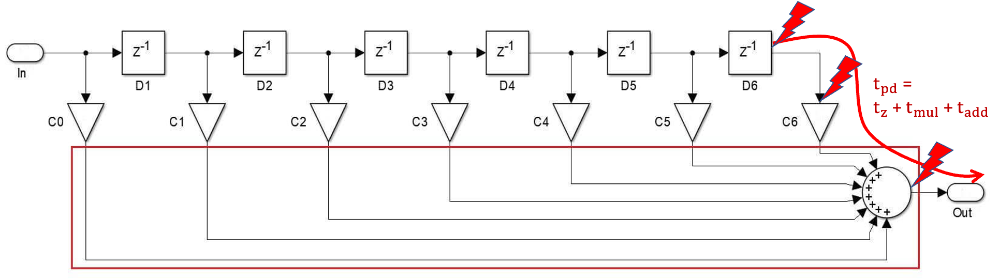
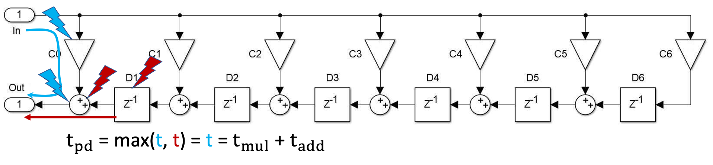
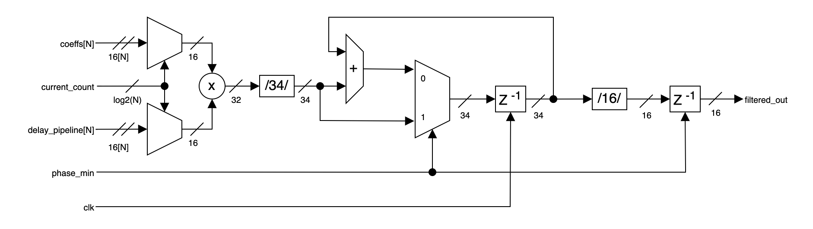

<table>
    <th>
      <a href="./chap3.md"><< CHƯƠNG TRƯỚC</a>
    </th>
    <th>
      4/5
    </th>
    <th>
      <a href="./chap5.md">CHƯƠNG SAU >>
    </th>
</table>

## 5. Thiết kế bộ lọc và bộ cân bằng âm thanh

### 5.1. Các thiết kế cho bộ lọc

#### 5.1.1. Thiết kế song song tất thảy (fully parallel)

##### a) Thiết kế song song tất thảy thuần thuý

##### b) Thiết kế song song tất thảy cải tiến (improved fully parallel)

#### 5.1.2. Thiết kế tuần tự tất thảy (fully serial)

#### 5.1.3. Tuần tự thành phần/thác đổ (partly/cascade serial)

<table>
    <th>
      <a href="./chap3.md"><< CHƯƠNG TRƯỚC</a>
    </th>
    <th>
      4/5
    </th>
    <th>
      <a href="./chap5.md">CHƯƠNG SAU >>
    </th>
</table>