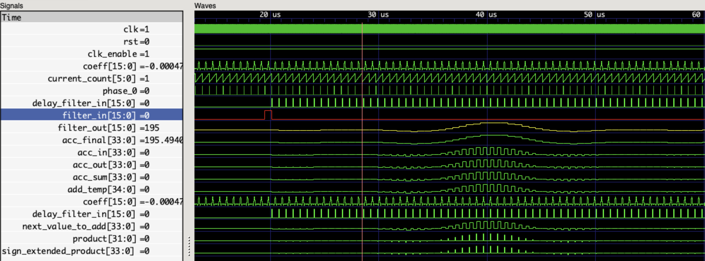
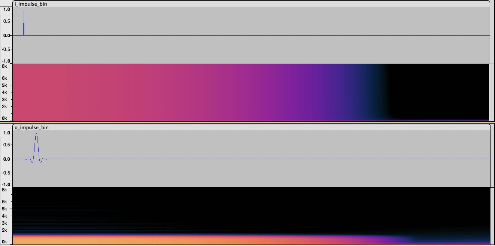
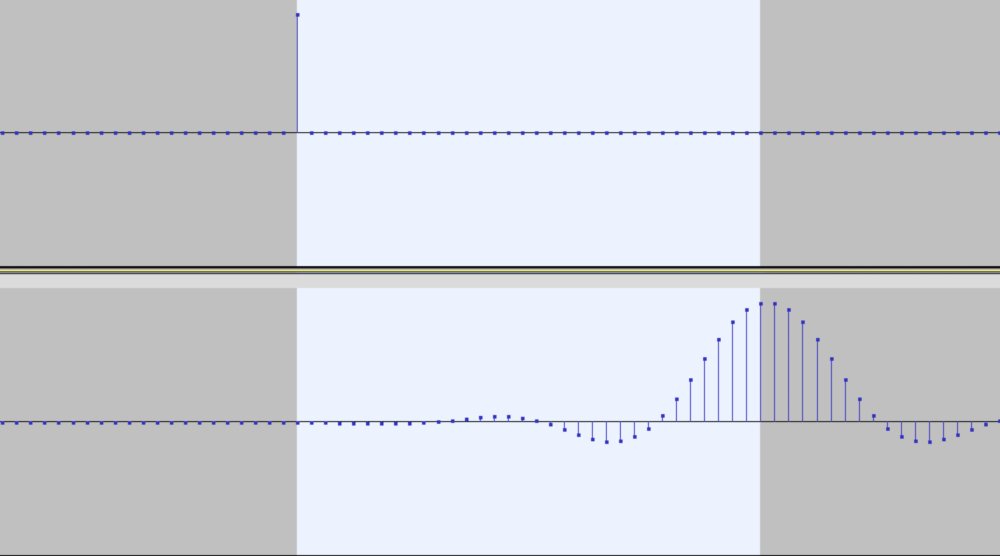
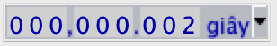
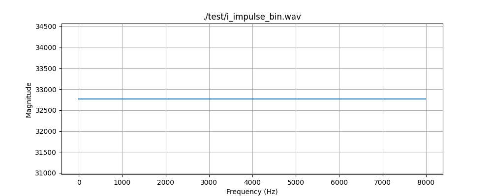
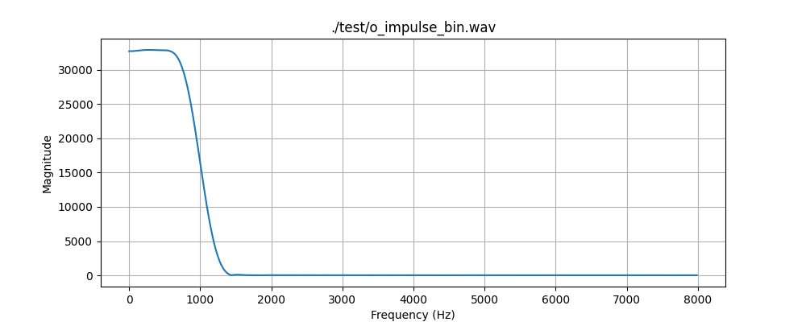
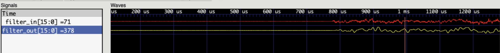
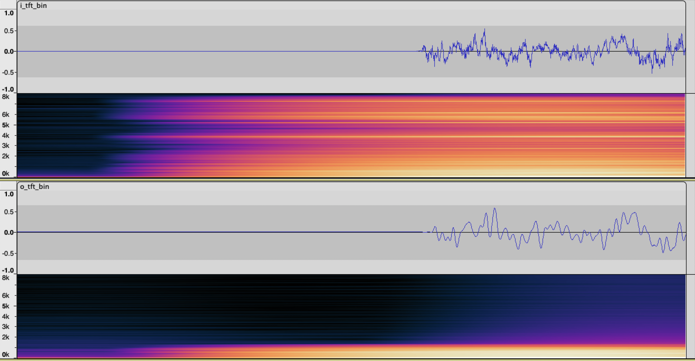
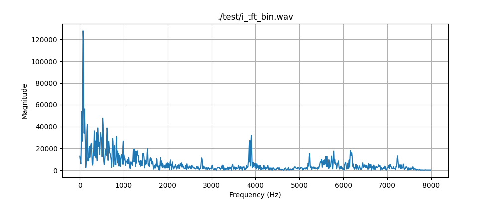
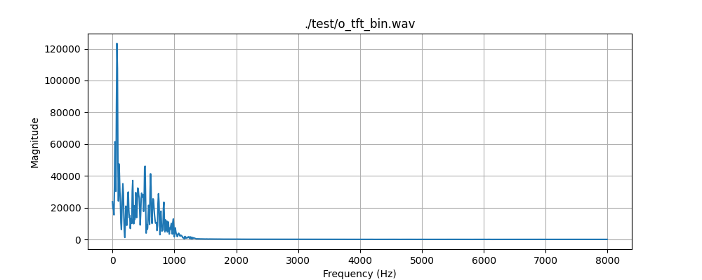

<table>
    <th>
      <a href="./chap3.md"><< CHƯƠNG TRƯỚC</a>
    </th>
    <th>
      4/4
    </th>
    <th>
      CHƯƠNG SAU
    </th>
</table>

## 5. Thử nghiệm
### Thiết kế tuần tự tất thảy
#### Thử nghiệm với testbench
##### Tín hiệu xung delta Dirac (impulse)

Kích hoạt xung Dirac với biên độ dương tối đa (32767) trong một mẫu tín hiệu 16 bit. Truyền xung này vào thực thể uut của module low pass filter N=63 với tần số cắt fc = 1000 KHz. Kết quả mô phỏng:

* Màu đỏ: Tín hiệu vào (impulse)
* Màu vàng: Tín hiệu sau khi lọc

Phổ tín hiệu theo thời gian và phổ tần số của đầu vào, đầu ra:

Phổ tần số của tín hiệu sau khi đi qua bộ lọc đã được cắt tại tần số đúng như mong muốn. Tín hiệu sau lọc có hình dạng của cửa sổ Hamming mà chúng ta đã thiết kế, điều này đúng như lý thuyết với việc áp dụng bộ lọc lên miền thời gian sẽ tương ứng việc thực hiện phép tích chập trong miền tần số. Mà một phép tích chập xung dirac với bất kỳ tín hiệu gì cũng sẽ là việc copy & paste ảnh phổ của tín hiệu đó tại trung tâm của nó vào chính điểm xung.

Thời gian trễ của tín hiệu khi đi qua bộ lọc trên lý thuyết ~ (số taps của bộ lọc / 2) * thời gian 1 mẫu tín hiệu = (63/2) * (1/16 KHz) ~ 2 ms. Trong thực tế khi kiểm tra bằng phần mềm đo đạc dạng sóng của file WAV cũng cho kết quả tương tự.

Phổ tín hiệu trước lọc:

Trên lý thuyết (nghe khá ảo) thì việc đưa 1 xung Dirac (chỉ đơn giản là một loạt các tín hiệu 0 nhưng trong đó duy nhất 1 mẫu là có giá trị) sẽ tạo ra năng lượng tại tất cả các tần số có thể (wow). Giờ khi động tay vào thực tế thì hình ảnh trên đã xác minh được lý thuyết ảo lòi đó là đúng!

Phổ tín hiệu sau lọc:

Sử dụng xung Dirac cho ta cái nhìn tổng quan nhất về sự ảnh hưởng của bộ lọc lên miền tần số vì tất cả năng lượng phổ của nó đều có giá trị bằng nhau và xuyên suốt mọi tần số có thể.

##### File âm thanh
Sử dụng file <a href="./Wav/wavs/tft.txt">tft.txt</a> được tạo ra từ việc đọc các mẫu tín hiệu trong file WAV gốc <a href="./Wav/wavs/tft.wav">tft.txt</a> bằng các phương thức được cung cấp trong lớp Wav tại code <a href="./Wav/wav.py">wav.py</a>.

Testbench đọc 2000 mẫu tín hiệu đầu tiên và đưa vào thực thể uut của module low pass filter N=63 với tần số cắt fc = 1000 KHz. Kết quả mô phỏng:

* Màu đỏ: Tín hiệu vào (impulse)
* Màu vàng: Tín hiệu sau khi lọc

Phổ tín hiệu, phổ tần số của 2000 mẫu tín hiệu gốc được đưa vào và lấy ra đầu ra tương ứng:

Phổ tần số của tín hiệu sau khi đi qua bộ lọc đã được cắt tại tần số đúng như mong muốn. Tín hiệu sau lọc có đường chuyển tiếp mềm mại hơn rất nhiều do tất cả vùng tần số cao của tín hiệu đã bị cắt bỏ.

Phổ tín hiệu trước lọc:

Phổ tín hiệu sau lọc:

Vẫn có thể nhận thấy được rò rỉ tần số tại dải chuyển tiếp, nhưng để đánh giá thì cần sử dụng các phương pháp tính toán chứ không "nhìn bằng mắt ta có" được.

<table>
    <th>
      <a href="./chap3.md"><< CHƯƠNG TRƯỚC</a>
    </th>
    <th>
      4/4
    </th>
    <th>
      CHƯƠNG SAU >>
    </th>
</table>